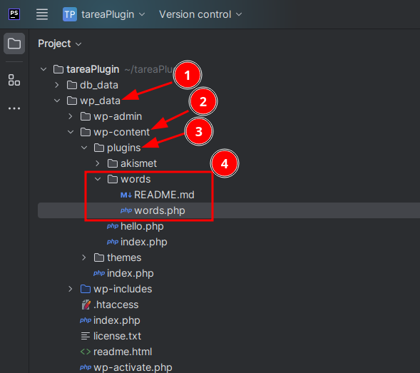
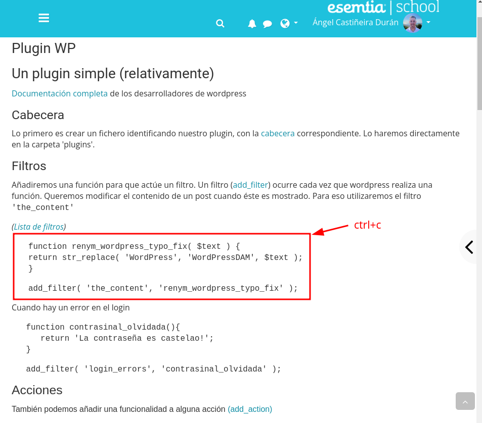
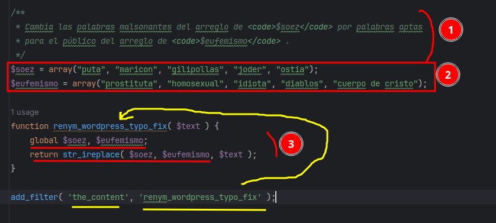
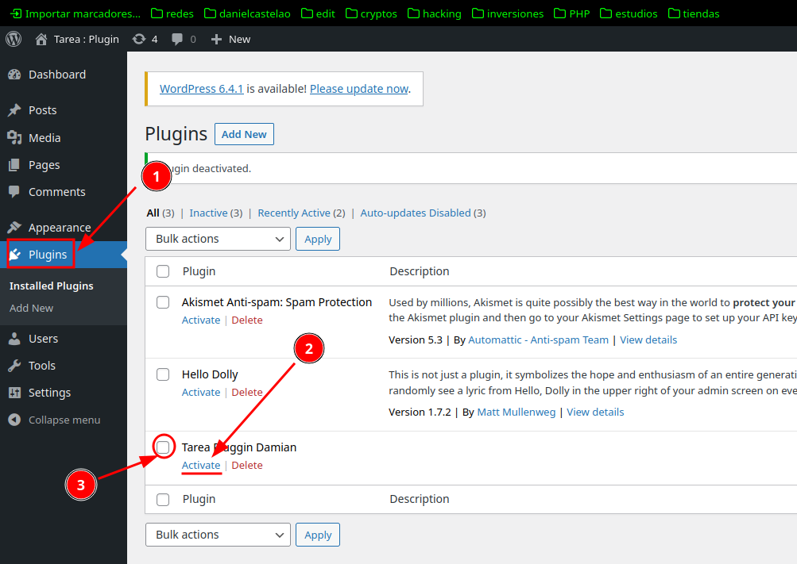
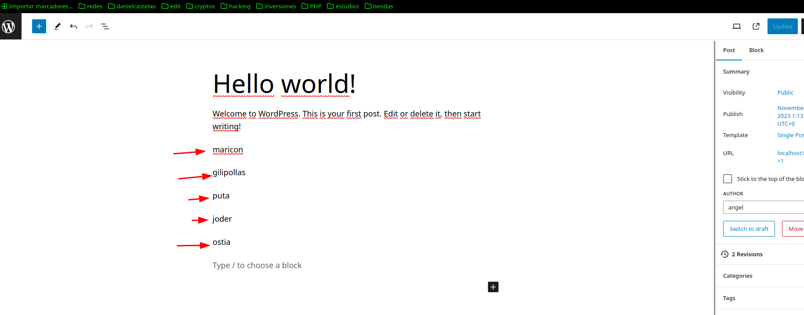
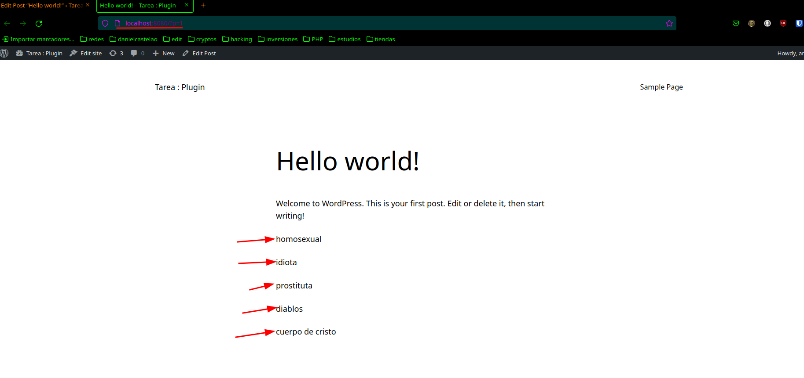

# TAREA
## Enunciado
Realiza un plugin en WP que utilice el hook 'the_content' (fijaros en los comentarios, hay mucha información muy interesante):

El plugin tiene que recorrer el contenido del post (esto ya lo hace el hook) y sustituir cinco palabras (pueden ser, por ejemplo, malsonantes) por otras. Utiliza array o algín tipo de dato parecido en PHP.

Ten en cuenta que este plugin vamos a seguir trabajando en él para que utilice la base de datos de WP y también que se pueda configurar desde el backend. Por lo tanto, estructura bien el código, separa los datos de la parte lógica, realiza funciones sencillas que realizen una sola cosa. De esta manera podremos ir evolucinando el código.

Adjunta el repositorio con únicamente el directorio del plugin, con un Readme explicatorio.

Se tiene que poder clonar el repositorio directamente en la carpeta plugin y activarlo desde cualquier instalación de WP.
## Solución
### Primeros pasos
1. Me dirijo a la carpeta plugin (pasos: 1,2 y 3).
2. Creo el readme y un archivo _.php_ (paso: 4).

   

### Función y filtro
Después de pegar en el archivo _.php_ el código subido a Esemtia...

1. Documento el metodo explicando su función.
2. Añado las variables de tipo `array()` cuyos elementos se intercambiarán en la función.
3. Convierto esas variables a globales para que las pueda utilizar 
en el cuerpo de la función y las devuelvo.

> Lo que esta indicado en amarillo muestra que le estoy 
> pasando el método creado al filtro
> "the content".

_Nota: He cambiado el método `str_replace()` 
del código copiado por `str_ireplace()` el cual
, al contrario que el anterior, no tiene en cuenta "caseSensitive".

### Configuracion Wordpress
Abro mi Wordpress en el navegador, activo el pluggin y lo checkeo
 para que se visualizce:

### Resultado
Observo que en el lado del cliente, se cambian las palabras malsonantes por los
eufemismos:

Servidor:

Cliente:
